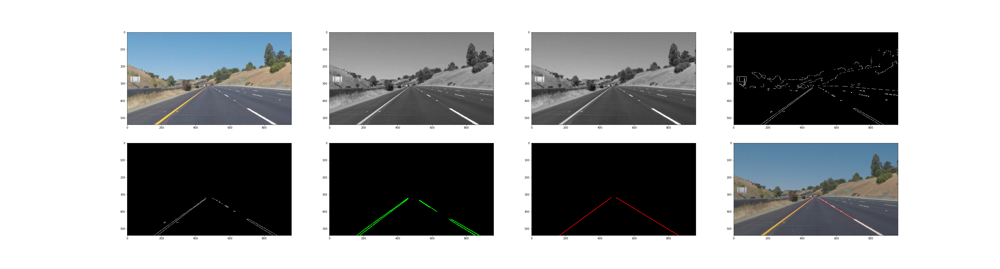

### 1. Finding Lane Lines on the Road

The first project of the self-driving car course deals with detecting lane lines on the road. The goals of this project are to correctly identify left and right lines on the road in video streams. 
Therefore an image processing pipeline shall be implemented which takes a video stream as input and outputs an annotated video stream showing the detected lines.

In this writeup I first present my pipeline, i.e. the image processing steps that are carried out in order to successfully detect the lane lines in the provided videos. Finally, I will reflect my work and will provide pontential suggestions for further improvements.

---

**Tools, Development Environment**

Anaconda, jupyter and spyder.

**Libraries**

This project is written in python and uses the following libraries:
* [opencv](http://opencv.org/): An image processing library written c/c++ with bindings for python. It contains many usefull algorithms.
* [numpy](http://www.numpy.org/): A python package used for scientific computing.
* [matplotlib](http://matplotlib.org/): A plotting library.


**Image Processing Pipeline**

In this section I describe my image processing pipeline which shall be able to detect lane lines at least under the following assumptions and constraints:
* The lane lines to be detected are more or less straight.
* The position of the camera that takes images is always the same, i.e. lane lines are always at the same position relative to the camera.
* Lightening conditions in the image are always constant. Images with good contrast shall be provided.
* The provided video stream is processed image by image.

***The pipeline***

The images below show the image processing steps (from left to right and top to bottom)



1. Read the image

2. Convert image to a grayscale

3. Apply gaussian blur to smooth the image.

4. Apply canny to detect edges.

5. Define an area of interest (AoI) and mask it with the image. Lane lines shall only be detected within the AoI.

6. Apply hough transform. Hough transform can be used to detect lines in an image.

7. Draw lines over detected lanes
  I've split this final step into several sub-steps:
  1. I've separated lines that I received from the hough transform into left and right lines. Therefore I simply looked at the x value (x2) of the second point of each line. If the value is smaller the image_width/2 then it belongs to the left lines otherwise to the right ones. This approach might be too simple and may be replaced by a more sophisiticated one!  Within this step I've also removed lines with an invalid slope. Line separation is done in the following function
  ```python
  def separate_lines(img, lines, draw_lines = True):
      """
      separates left from right lane lines and returns them 
      """
      color=[0, 255, 0] 
      thickness=2

      leftLines = []
      rightLines = []

      for line in lines:
          for x1,y1,x2,y2 in line:
              # lines with an invalid slope will not be taken into account
              slope,intercept = calc_slope_and_intercept(x1, y1, x2, y2)                                

              if np.isnan(slope):
                  continue

              # This line belongs to the left lines if the x value of the second point x2
              # is smaller then imagewidth/2.
              if x2 < img.shape[1]/2:
                  leftLines.append(line)
              else:
                  rightLines.append(line)

              # Draw lines
              if draw_lines:
                  cv2.line(img, (x1,y1), (x2,y2), color, thickness)

      return leftLines, rightLines
      ```
  
  2. I've applied a linear regression, see extrapolate() function, on the left and right line. And then used the outcome (slope and intercept) to calculate the start and end points for the final lines which are than drawn, see draw_lines, as red lines on the original image.
    ```python
    def extrapolate(lines, from_, to_):
    from scipy import stats
    
    pointsX = []
    pointsY = []
    
    for line in lines:
        for x1,y1,x2,y2 in line:
            pointsX.append(x1)
            pointsX.append(x2)
            pointsY.append(y1)
            pointsY.append(y2)

    slope, intercept, r_value, p_value, std_err = stats.linregress(pointsX, pointsY)      
    
    return get_line(slope, intercept, from_, to_)
        
  def draw_lines(img, left, right,from_, to_, color=[255, 0, 0], thickness=2):
      """
      Draws a single line over the left and right lane. It does a linear regression
      and calculates the top and bottom point for the calculated line.
      """        
      if len(left) > 0:
          leftPoints = extrapolate(left, from_, to_)

          if (len(leftPoints) > 0):        
              cv2.line(img, leftPoints[0], leftPoints[1], color, thickness)

      if len(right) > 0:
          rightPoints = extrapolate(right, from_, to_)

          if (len(rightPoints) > 0):
              cv2.line(img, rightPoints[0], rightPoints[1], color, thickness)
    ```
---

### 2. Identify potential shortcomings with your current pipeline
Up to now my solution has several shortcomings besides the fact is not able to correctly draw the lines on the challenge video 
  1. It is not robust against outliers, i.e. against lines which do not really belong to a lane. Currently I simply do not take any lines into account whose slope is smaller than 0.5 - assuming that these lines do not belong to a lane which may not be the case in general.
  2. I should also rethink my line separation approach, i.e. deciding whether a certain line belongs to the left or right lane.
  3. Lines are only drawn if there has been at least one line correctly detected. This could also be improved.

###3. Suggest possible improvements to your pipeline

A possible improvement would be to ...

Another potential improvement could be to ...
